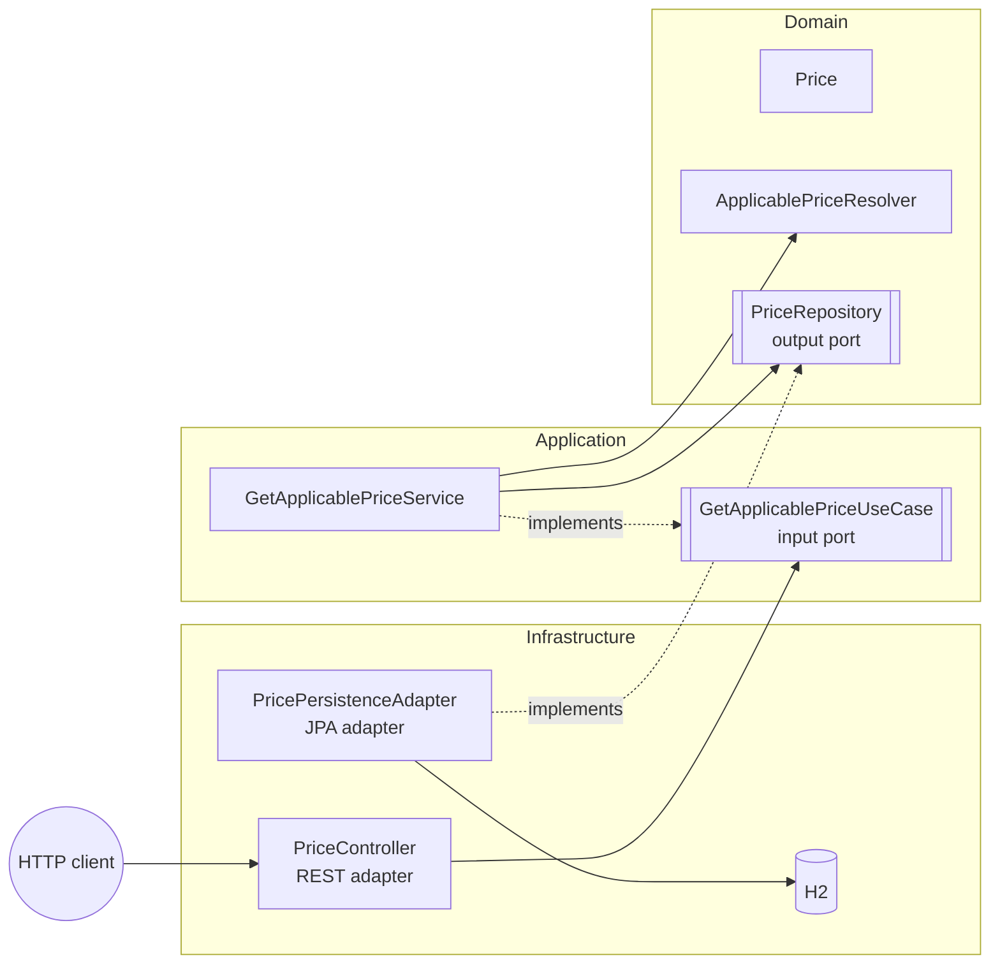

# Pricing Service

[](../../actions/workflows/ci.yml)

REST service that returns the **final price** to apply to a product of a brand at a given date,
built with **Spring Boot 4**, **Java 21** and **Hexagonal Architecture**.

---

## Table of contents

- [The problem](#the-problem)
- [Tech stack](#tech-stack)
- [Getting started](#getting-started)
- [API](#api)
- [Architecture](#architecture)
- [Design decisions](#design-decisions)
- [Testing](#testing)
- [Git workflow](#git-workflow)
- [AI-assisted development](#ai-assisted-development)

---

## The problem

The e-commerce database stores a `PRICES` table with the tariffs that a brand applies to a product
within a date range. Several tariffs may overlap in time; in that case the one with the **highest
`PRIORITY`** wins.

| BRAND_ID | START_DATE          | END_DATE            | PRICE_LIST | PRODUCT_ID | PRIORITY | PRICE | CURR |
|---------:|---------------------|---------------------|-----------:|-----------:|---------:|------:|------|
| 1        | 2020-06-14 00:00:00 | 2020-12-31 23:59:59 | 1          | 35455      | 0        | 35.50 | EUR  |
| 1        | 2020-06-14 15:00:00 | 2020-06-14 18:30:00 | 2          | 35455      | 1        | 25.45 | EUR  |
| 1        | 2020-06-15 00:00:00 | 2020-06-15 11:00:00 | 3          | 35455      | 1        | 30.50 | EUR  |
| 1        | 2020-06-15 16:00:00 | 2020-12-31 23:59:59 | 4          | 35455      | 1        | 38.95 | EUR  |

The service receives an **application date**, a **product id** and a **brand id**, and returns the
product id, brand id, price list, application date range and final price.

### Business rules

1. A price is applicable when `START_DATE <= applicationDate <= END_DATE` (both boundaries inclusive).
2. Among applicable prices, the highest `PRIORITY` wins.
3. On a priority tie (not present in the sample data), the price with the most recent `START_DATE`
   wins, so the result is always deterministic.
4. If no price applies, the service answers `404 Not Found`.

---

## Tech stack

| Concern         | Choice                                                       |
|-----------------|--------------------------------------------------------------|
| Language        | Java 21 (records, text blocks)                               |
| Framework       | Spring Boot 4 (Web, Data JPA, Validation, Actuator)          |
| Database        | H2 in-memory, initialised with `schema.sql` / `data.sql`     |
| API docs        | springdoc-openapi (Swagger UI)                               |
| Testing         | JUnit 5, AssertJ, Mockito, MockMvc, `@DataJpaTest`, ArchUnit |

---

## Getting started

### Prerequisites

- JDK 21
- Maven 3.9

### Run locally

```bash
mvn spring-boot:run
```

The service starts on `http://localhost:8080`.

| Resource    | URL                                              |
|-------------|--------------------------------------------------|
| Swagger UI  | http://localhost:8080/swagger-ui.html            |
| OpenAPI     | http://localhost:8080/v3/api-docs                |
| H2 console  | http://localhost:8080/h2-console (JDBC URL `jdbc:h2:mem:pricingdb`, user `sa`, no password) |
| Health      | http://localhost:8080/actuator/health            |


## API

### `GET /api/v1/prices`

| Query parameter   | Type                         | Required | Example               |
|-------------------|------------------------------|----------|-----------------------|
| `applicationDate` | ISO-8601 date-time           | yes      | `2020-06-14T16:00:00` |
| `productId`       | positive integer             | yes      | `35455`               |
| `brandId`         | positive integer             | yes      | `1`                   |

**Request**

```bash
curl "http://localhost:8080/api/v1/prices?applicationDate=2020-06-14T16:00:00&productId=35455&brandId=1"
```

**200 OK**

```json
{
  "productId": 35455,
  "brandId": 1,
  "priceList": 2,
  "startDate": "2020-06-14T15:00:00",
  "endDate": "2020-06-14T18:30:00",
  "price": 25.45,
  "currency": "EUR"
}
```

**404 Not Found** (`application/problem+json`)

```json
{
  "type": "about:blank",
  "title": "Price not found",
  "status": 404,
  "detail": "No applicable price found for brand 1, product 35455 at 2019-01-01T00:00",
  "instance": "/api/v1/prices"
}
```

**400 Bad Request** is returned for missing parameters, malformed dates or non-positive identifiers.

Ready-to-run requests are available in [`http/prices.http`](http/prices.http)
(IntelliJ HTTP Client / VS Code REST Client).

---

## Architecture

The project follows **Hexagonal Architecture (Ports & Adapters)**. Dependencies always point
inwards: infrastructure → application → domain.



```
src/main/java/com/ecommerce/price_service
├── domain                          # Pure Java, no framework dependencies
│   ├── model/Price                 # Aggregate with invariants and applicability rule
│   ├── service/ApplicablePriceResolver   # Priority algorithm (Streams)
│   ├── repository/PriceRepository  # Output port
│   └── exception/PriceNotFoundException
├── application                     # Pure Java, orchestrates the domain
│   ├── port/in/GetApplicablePriceUseCase  # Input port
│   ├── port/in/GetApplicablePriceQuery
│   └── service/GetApplicablePriceService  # Use case implementation
└── infrastructure                  # Everything Spring-related
    ├── adapter/in/rest             # Controller, DTO, mapper, exception handler
    ├── adapter/out/persistence     # JPA entity, Spring Data repository, mapper, adapter
    └── config/BeanConfiguration    # Wires domain & application classes as beans
```

These rules are **enforced by tests** (`HexagonalArchitectureTest`, ArchUnit): the build fails if the
domain or application layers depend on Spring, JPA or Jackson, or if an inner layer depends on an
outer one.

---

## Design decisions

- **Framework-free core.** Domain and application classes carry no annotations; they are registered
  in `BeanConfiguration`. The business logic can be tested with plain JUnit and would survive a
  framework change.
- **Priority resolution in the domain, with Streams.** The database narrows the candidates
  (brand, product and date range, backed by a composite index), and `ApplicablePriceResolver`
  picks the winner with a `Stream` + `Comparator` (`priority`, then `startDate`). The business rule
  lives in one testable place instead of being hidden in a `ORDER BY ... LIMIT 1` query. For large
  data volumes, pushing the ordering down to the database would be a straightforward optimisation
  behind the same port.
- **Deterministic tie-breaking.** Equal priorities are not in the sample data but are possible in
  real data, so the resolver breaks ties by the most recent start date instead of returning an
  arbitrary row.
- **Rich domain model.** `Price` is an immutable record that validates its own invariants
  (non-null fields, `start <= end`, non-negative amount) and owns the `isApplicableAt` rule.
  Amounts use `BigDecimal` and currencies use `java.util.Currency`.
- **Explicit schema.** `schema.sql` defines types, constraints and an index; Hibernate schema
  generation is disabled so the database contract is visible and reviewable.
- **Standard errors.** Errors follow RFC 7807 (`application/problem+json`) through a single
  `@RestControllerAdvice`.
- **Versioned API.** The endpoint lives under `/api/v1` so future breaking changes can coexist.

---

## Testing

```bash
mvn test
```

| Level        | Class                                  | What it covers |
|--------------|----------------------------------------|----------------|
| Unit         | `PriceTest`                            | Invariants and inclusive date boundaries |
| Unit         | `ApplicablePriceResolverTest`          | Stream algorithm: priority, order independence, filtering, tie-breaking |
| Unit         | `GetApplicablePriceServiceTest`        | Use case orchestration with a mocked output port |
| Slice        | `PricePersistenceAdapterTest`          | JPA query and entity → domain mapping against H2 |
| Integration  | `PriceControllerIntegrationTest`       | The 5 required scenarios end-to-end, plus 400/404 cases |
| Architecture | `HexagonalArchitectureTest`            | Layer dependency rules |

### Required scenarios (product `35455`, brand `1`)

| Test | Application date    | Expected price list | Expected price |
|------|---------------------|--------------------:|---------------:|
| 1    | 2020-06-14 10:00    | 1                   | 35.50 EUR      |
| 2    | 2020-06-14 16:00    | 2                   | 25.45 EUR      |
| 3    | 2020-06-14 21:00    | 1                   | 35.50 EUR      |
| 4    | 2020-06-15 10:00    | 3                   | 30.50 EUR      |
| 5    | 2020-06-16 21:00    | 4                   | 38.95 EUR      |

---

## Git workflow

Development was done on a single feature branch, `feature/price-service`, and merged into `main`
through a pull request. Since the service exposes a single use case, the whole implementation was
treated as one feature.

Commits follow [Conventional Commits](https://www.conventionalcommits.org) and are ordered to tell
the story of the implementation from the inside out: domain → application → infrastructure →
tooling.

```bash
git log --oneline --reverse
```

---


